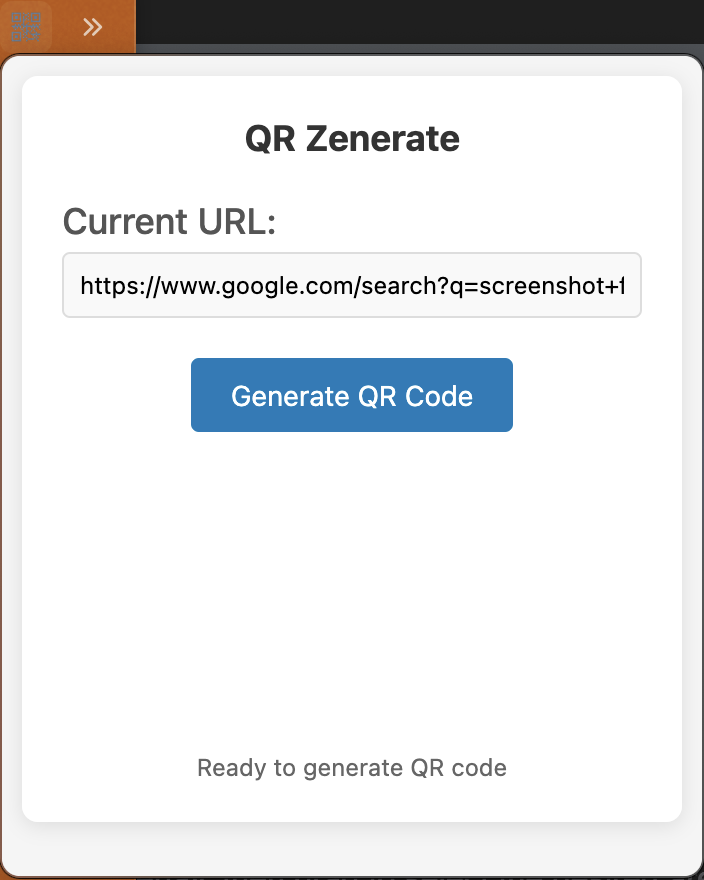
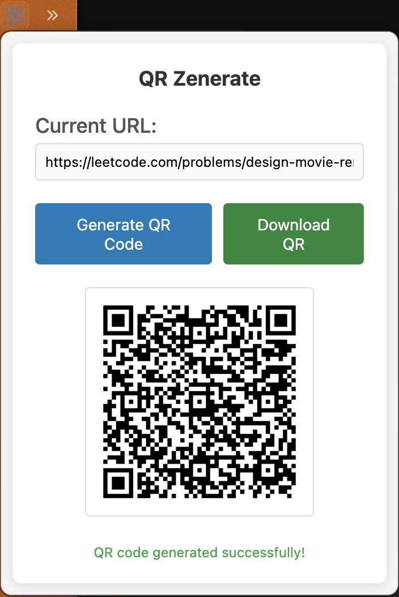
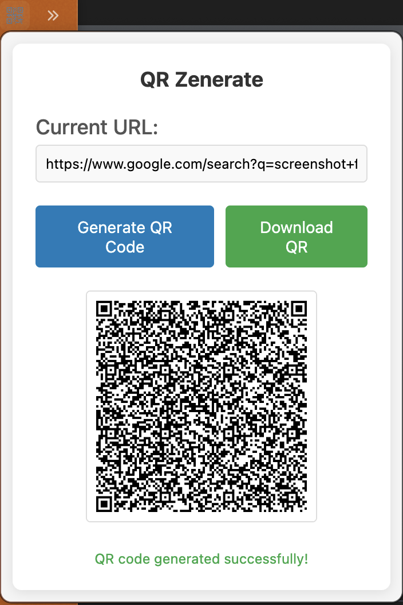

# Zen Browser Mod - QR Zenerate

QR-Zenerate is a QR code generator mod for Zen Browser, because I had this in my prior browser, Brave but it's not on Zen Browser.






## Features

- Generate QR codes for any web page URL
- Automatic URL detection from active browser tab
- Download generated QR codes as PNG files
- Clean, responsive popup interface
- Right-click context menu integration
- Optimized QR code sizing for browser extension popups

## Installation

1. Download or clone this repository
2. Open Zen Browser and navigate to `about:debugging`
3. Click "This Zen" in the sidebar
4. Click "Load Temporary Add-on"
5. Select the `manifest.json` file from the project directory
6. The extension will appear in your toolbar

## Usage

1. Navigate to any website
2. Click the QR Zenerate icon in the toolbar
3. The current tab's URL will be displayed automatically
4. Click "Generate QR Code" to create the QR code
5. Click "Download QR" to save the image to your computer

## File Structure

```
zen-qr-extension/
├── manifest.json         # Extension configuration
├── popup.html            # Popup interface
├── popup.css             # Popup styling
├── popup.js              # Main extension logic
├── background.js         # Background script
├── lib/
│   └── qrcode.min.js     # QR code generation library
└── icons/
```

## Requirements

- Zen Browser (Firefox-based)
- Icons in PNG format (16x16, 48x48, 128x128 pixels)
- QRCode.js library (included in lib/ directory)

## Development

The extension uses the WebExtensions API (Manifest V2) and is compatible with Firefox-based browsers. Key components:

- **Manifest V2**: Extension configuration and permissions
- **Popup Interface**: HTML/CSS/JavaScript popup window
- **Tabs API**: Access to current tab URL
- **QRCode Generation**: Canvas-based QR code rendering
- **File Download**: Browser download API integration

## Permissions

- `activeTab`: Access current tab information
- `tabs`: Query browser tabs
- `<all_urls>`: Access URLs from all websites

## Browser Compatibility

Designed specifically for Zen Browser but compatible with other Firefox-based browsers that support WebExtensions API.

## License

This project is provided as-is for educational and personal use.
